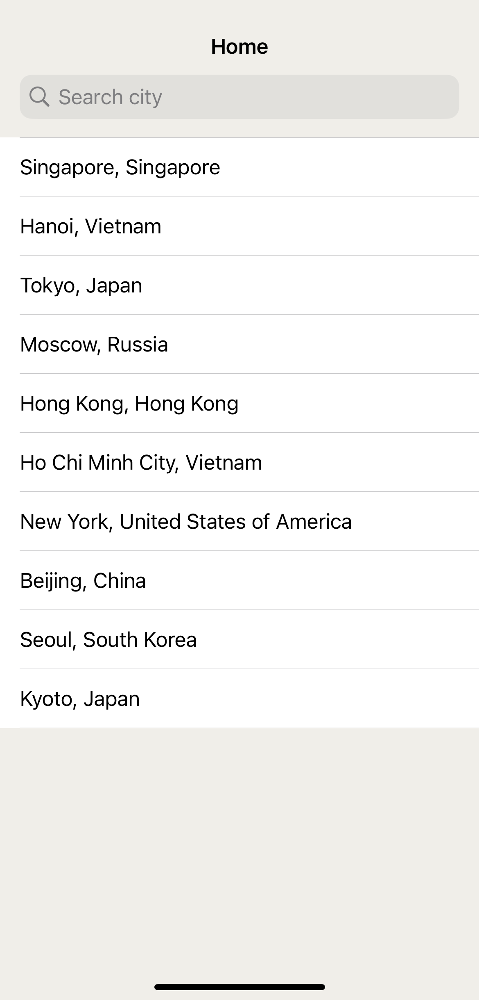
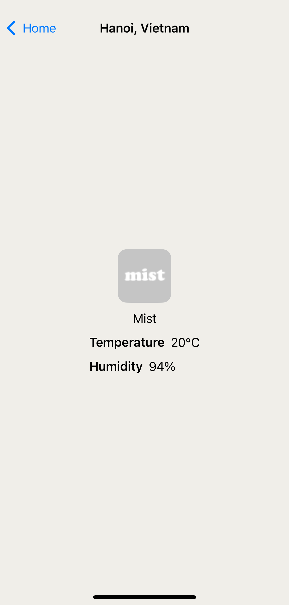
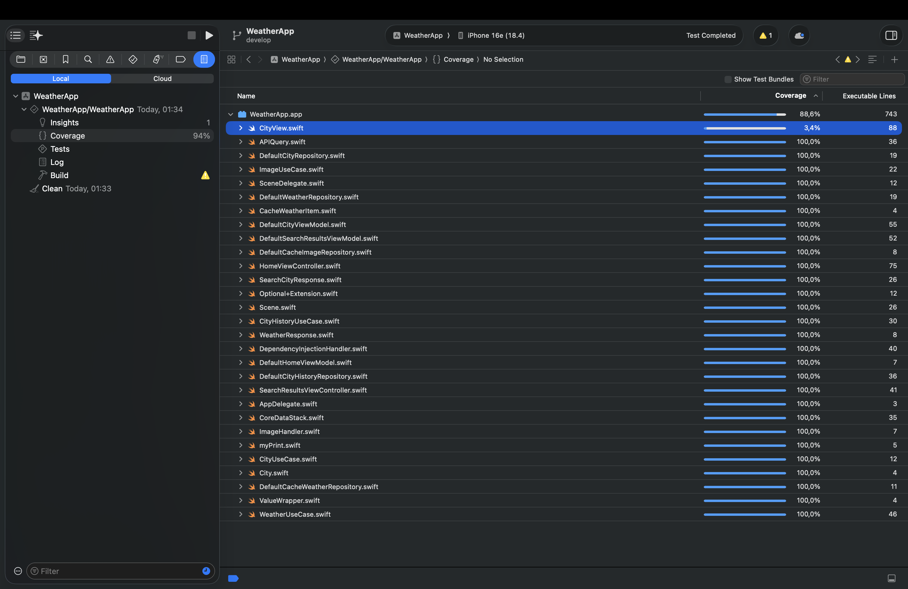

# WeatherAppAssignment
This is my assignment for a great job opportunity

## Screenshots

| Home | Search | City |
|------|--------|------|
|  |  |  |

## Coverage
Coverage 100% for all files except `CityView.swift` (SwiftUI view)

